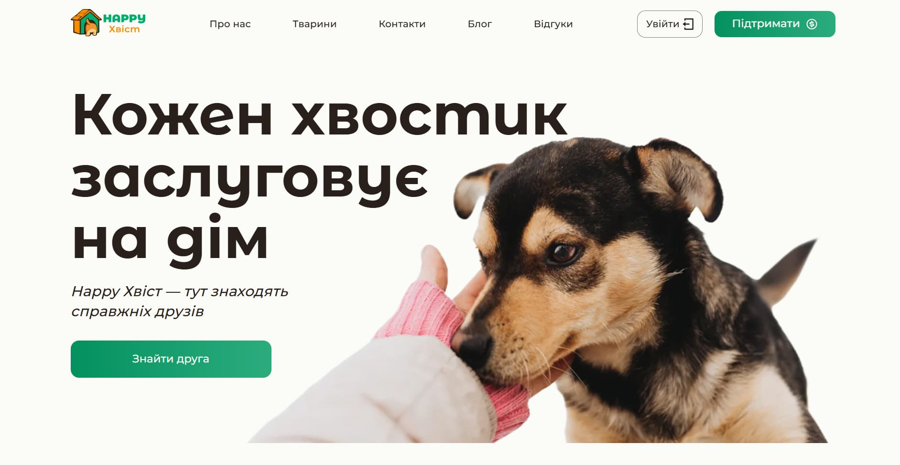
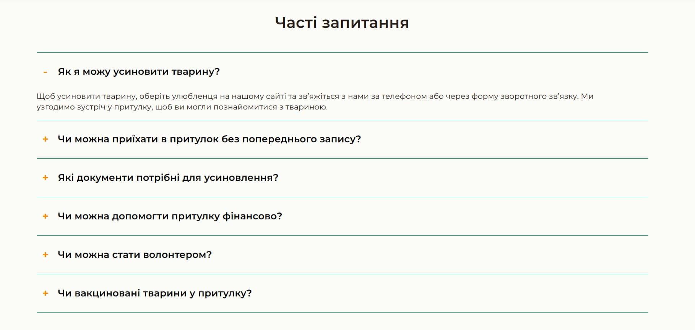
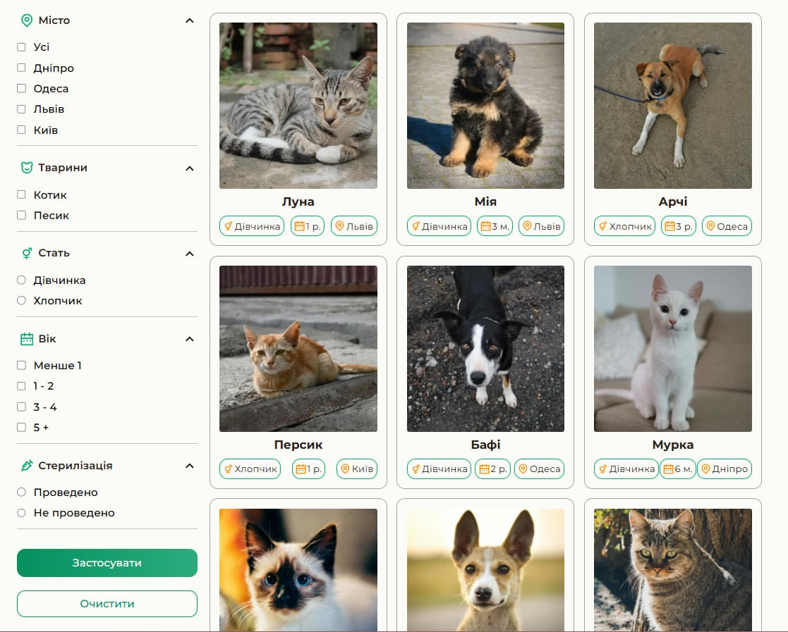
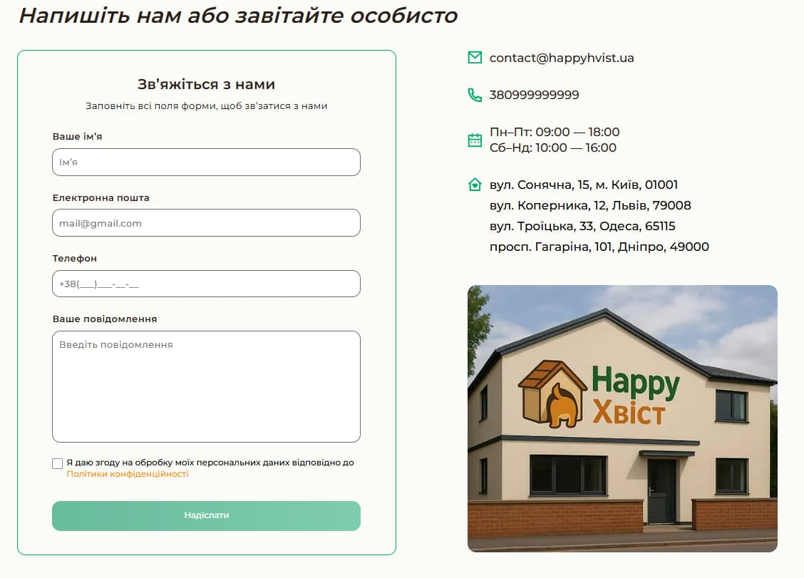
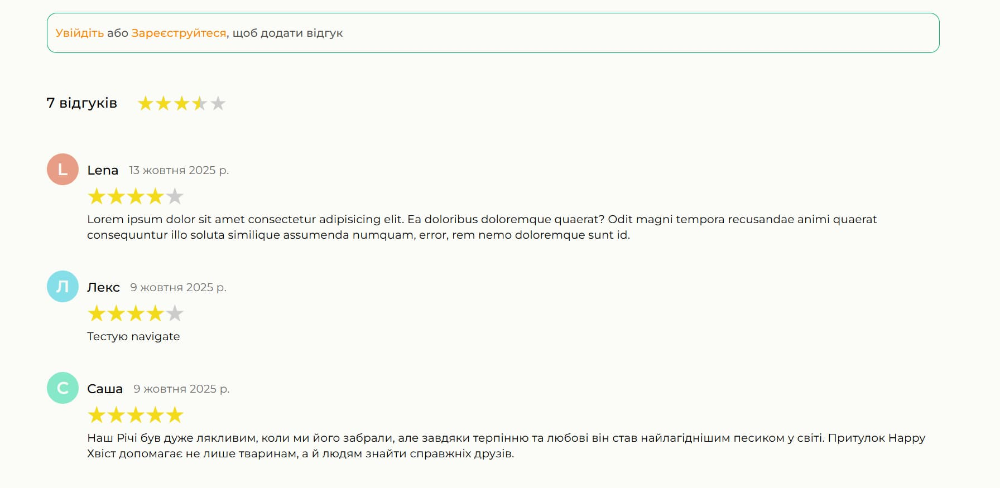
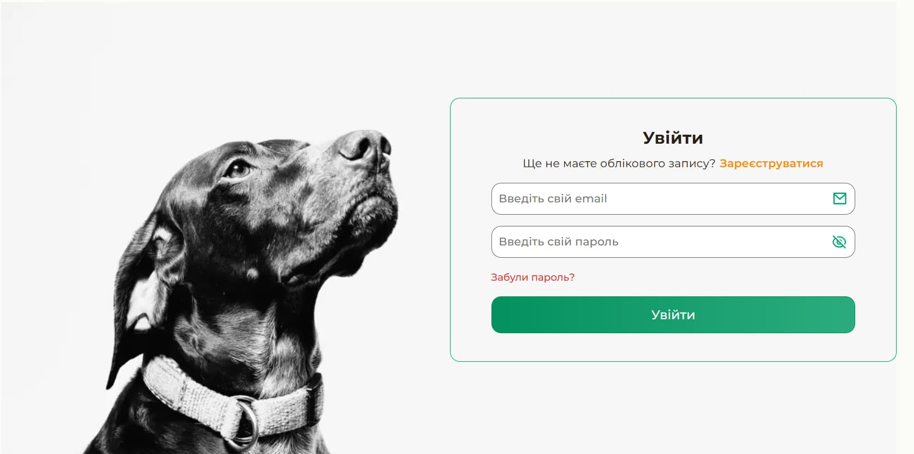

# 🐾 Happy Tail

**Happy Tail** is a pet adoption platform that helps users find, view, and adopt pets.  
Registered users can leave reviews, read others' experiences, and connect with the shelter through the contact form.  
Built as a personal pet project to practice full-stack development, responsive UI, and user interaction.

---

## 🌐 Live Demo

🔗 [Frontend (Vercel)](https://happy-tail-three.vercel.app/)  
🔗 [Backend (Vercel)](https://happy-tail-backend.vercel.app/)  
📦 [Backend Repository](https://github.com/Vlad-Kovalov9/HappyTail-Backend)

---

## ⚙️ Tech Stack

- **Frontend:** React + Vite
- **State Management:** Redux
- **Routing:** React Router
- **Styling:** CSS Modules
- **Slider:** Swiper
- **Backend:** Node.js + Express
- **Database:** MongoDB (via Mongoose)
- **Deployment:** Vercel
- **API communication:** Axios

---

## 🚀 Features

- 🐕 View and filter pets
- 👤 User authentication (Register / Login)
- 💬 Leave and delete personal reviews (only for authenticated users)
- 📃 Reviews displayed as slider on HomePage and as list on Reviews page
- 📄 Separate pet detail page
- 📞 Contact form with feedback section
- ❓ FAQ Accordion — interactive section for frequently asked questions
- 🔢 Counters on About page using CountUp & intersection observer to animate stats:
  - Number of pets adopted
  - Years of experience
  - Vaccinated/spayed pets
  - Pets currently looking for a home
- 📱 Fully responsive design (mobile first, optimized for 390px / 768px / 1440px)
- 🍔 Responsive burger menu for mobile and tablet devices

---

## 📸 Screenshots

### 🏠 HomePage Sections


_Main section with call to action and navigation_

_About shelter and animated counters_

_Pet list_

_Slider with user reviews and testimonials_

_Accordion with frequently asked questions_

_Contact info, social links, and navigation footer_

### 🐾 AboutUsPage


_About shelter and animated counters_

### 🐶 PetsPage


_Pet list with filtering options_

### ✉️ ContactsPage


_Contact form with validation and feedback section_

### 📰 BlogPage


_List of articles about pet care_

### 💬 ReviewsPage


_List of user reviews with option to add or delete your own_

### 🔐 LoginPage


_User authentication form with validation_

### 📝 RegisterPage


_New user registration form with input validation_

---

## 🧩 Project Structure

```
happy-tail/
├── src/
│ ├── components/
│ ├── pages/
│ ├── redux/
│ ├── assets/
│ ├── utils/
│ └── main.jsx
├── public/
├── package.json
└── vite.config.js
```

---

## 🧠 Future Improvements

- 🐾 Add admin dashboard for managing pets and reviews
- 🌈 Add animations and micro-interactions
- 💾 Implement user profile page
- 📷 Upload photos directly from the form

---

## 🧑‍💻 Author

**Vlad Kovalov**  
📧 [GitHub Profile](https://github.com/Vlad-Kovalov9)

---

## 🪪 License

This project is open source and available under the [MIT License](LICENSE).
