# 🐾 Happy Tail

**Happy Tail** — це платформа для всиновлення тварин, яка допомагає користувачам знаходити, переглядати та усиновлювати тваринок.  
Зареєстровані користувачі можуть залишати відгуки, читати досвід інших та зв’язуватись з притулком через форму зворотного зв’язку.  
Створено як пет-проєкт для практики full-stack розробки, адаптивної верстки та роботи з користувачами.

---

## 🌐 Live Demo

🔗 [Фронтенд (Vercel)](https://happy-tail-three.vercel.app/)  
📦 [Репозиторій бекенду](https://github.com/Vlad-Kovalov9/HappyTail-Backend)

---

## ⚙️ Технології

- **Фронтенд:** React + Vite
- **Стан додатку:** Redux
- **Маршрутизація:** React Router
- **Стилізація:** CSS Modules
- **Слайдер:** Swiper
- **Бекенд:** Node.js + Express
- **База даних:** MongoDB (через Mongoose)
- **Деплой:** Vercel
- **API-запити:** Axios

---

## 🚀 Можливості

- 🐕 Перегляд та фільтрація тварин
- 👤 Реєстрація та авторизація користувачів
- 💬 Залишення та видалення власних відгуків (доступно лише авторизованим користувачам)
- 📃 Відгуки відображаються у вигляді слайдера на головній сторінці та списком на сторінці “Відгуки”
- 📄 Окрема сторінка детальної інформації про тварину
- 📞 Форма зворотного зв’язку у секції “Контакти”
- ❓ Аккордеон FAQ — інтерактивна секція з частими питаннями
- 🔢 Лічильники на сторінці “Про нас” з анімацією (CountUp + intersection observer):
  - Кількість хвостиків, що знайшли нову сім’ю
  - Роки досвіду турботи про тварин
  - Вакциновані та стерилізовані тварини
  - Хвостики, що шукають дім
- 📱 Повністю адаптивна верстка (mobile first, 390 / 768 / 1440px)
- 🍔 Адаптивне бургер-меню для мобільних та планшетних пристроїв

---

## 📸 Скриншоти

### 🏠 Головна сторінка (HomePage)

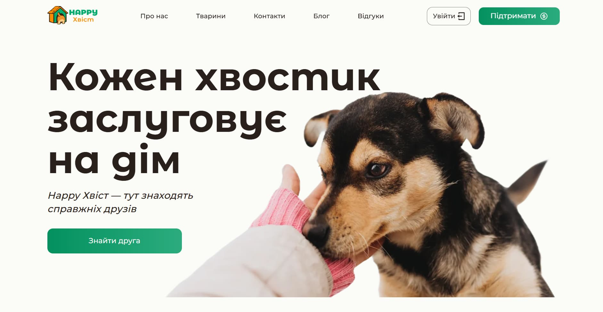  
_Головна секція із закликом до дії та навігацією_

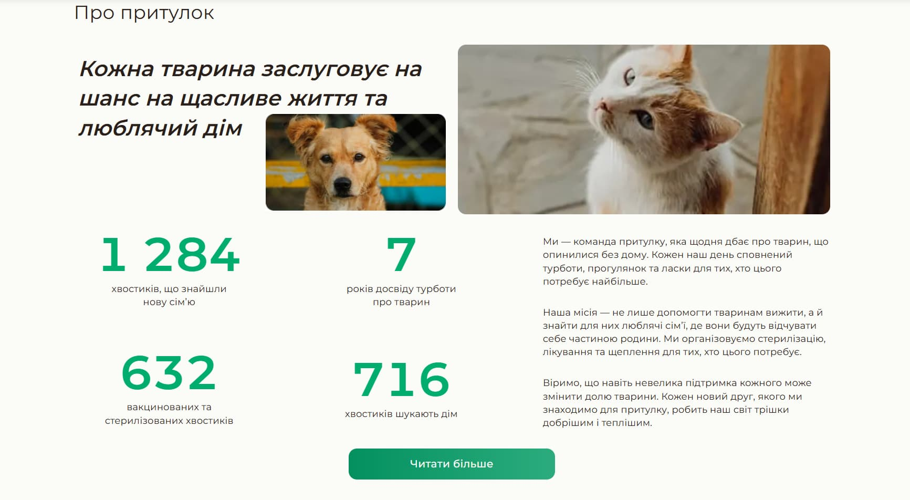  
_Інформація про притулок та анімовані лічильники_

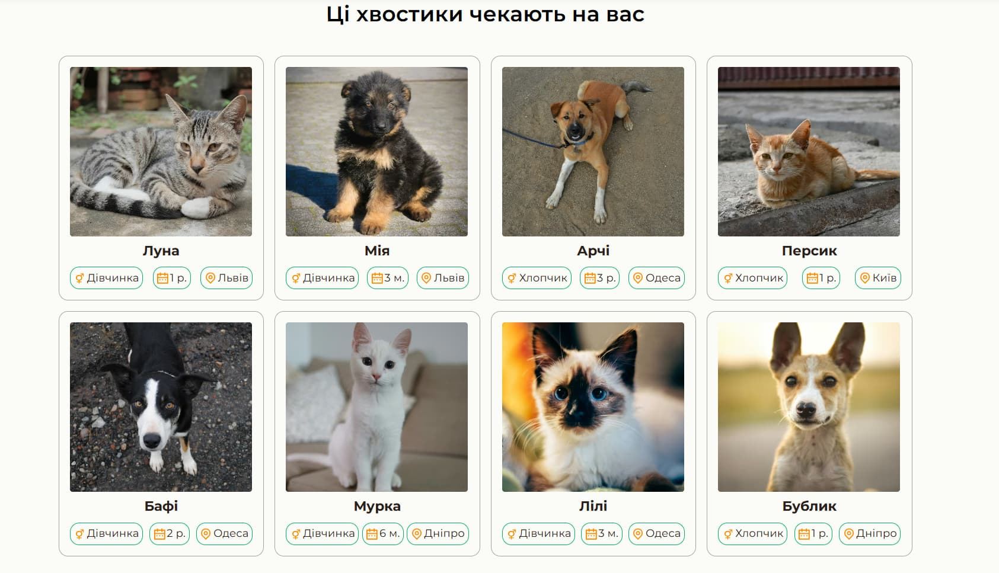  
_Список тварин, доступних для всиновлення_

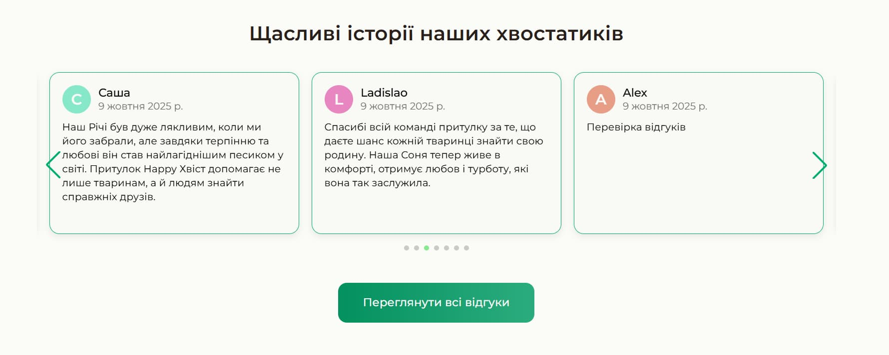  
_Слайдер із відгуками користувачів_

  
_Аккордеон із часто задаваними питаннями_

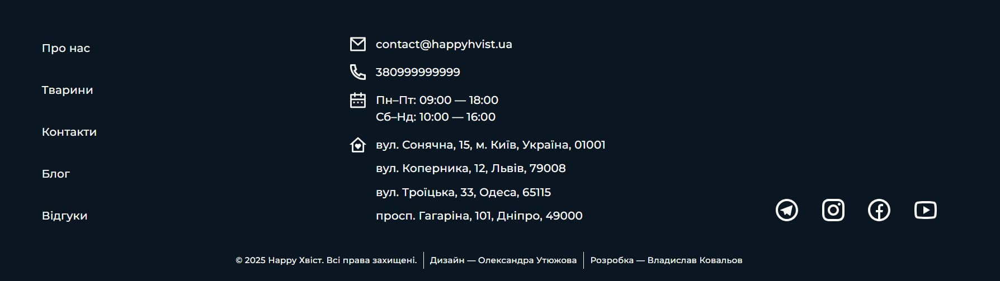  
_Контактна інформація, соціальні мережі та навігація_

### 🐾 Сторінка «Про нас» (About Us)

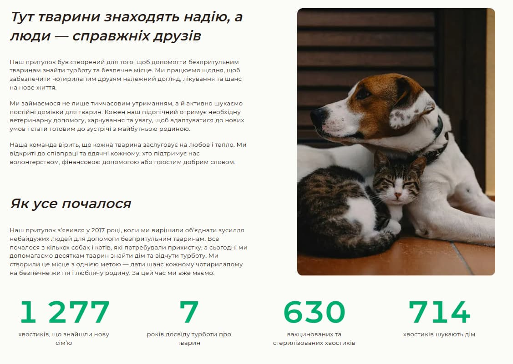  
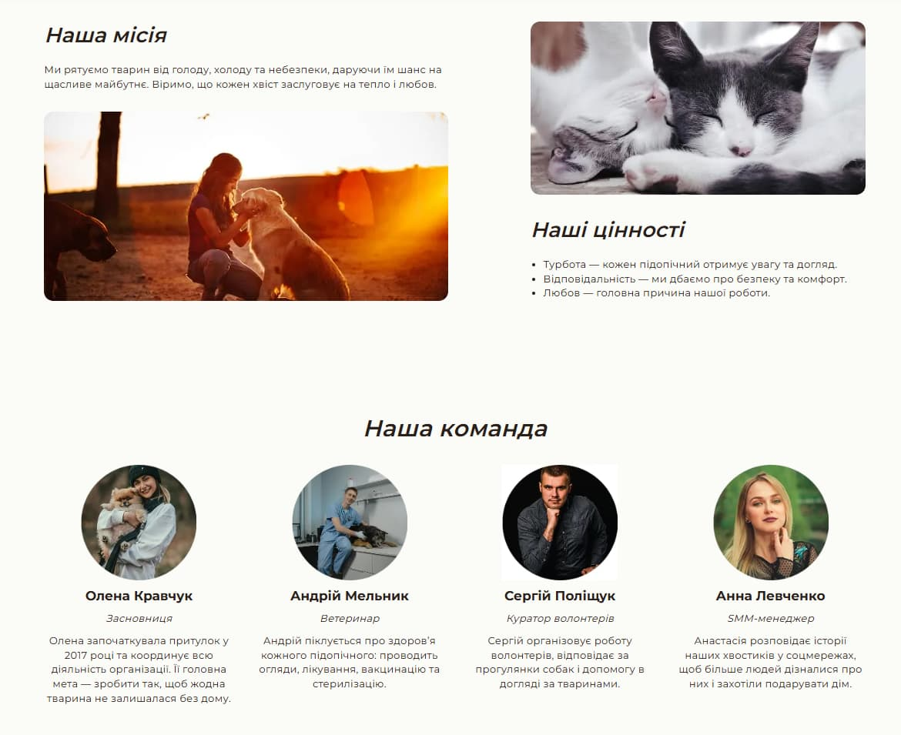  
_Інформація про притулок, його місію та статистику_

### 🐶 Сторінка «Тварини» (Pets)

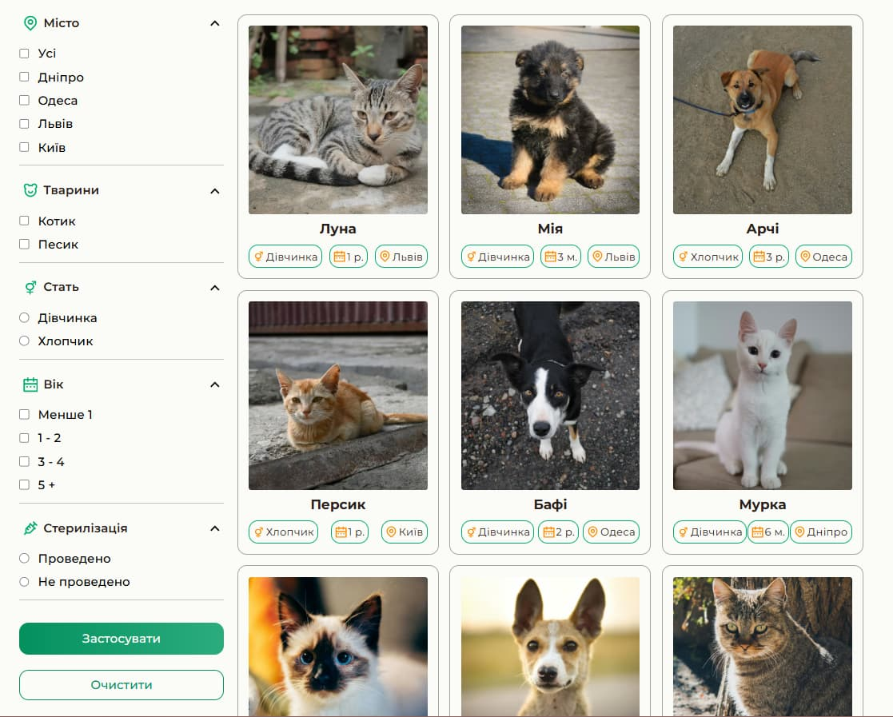  
_Каталог тварин із можливістю фільтрації_

### ✉️ Сторінка «Контакти» (Contacts)

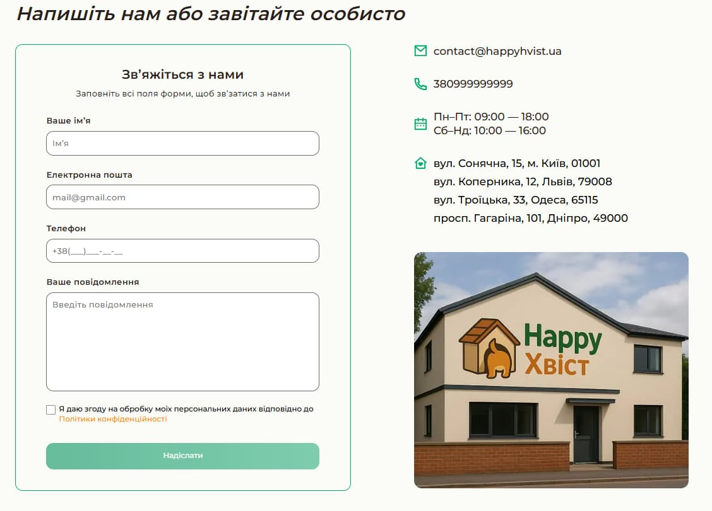  
_Форма зворотного зв’язку з валідацією_

### 📰 Сторінка «Блог» (Blog)

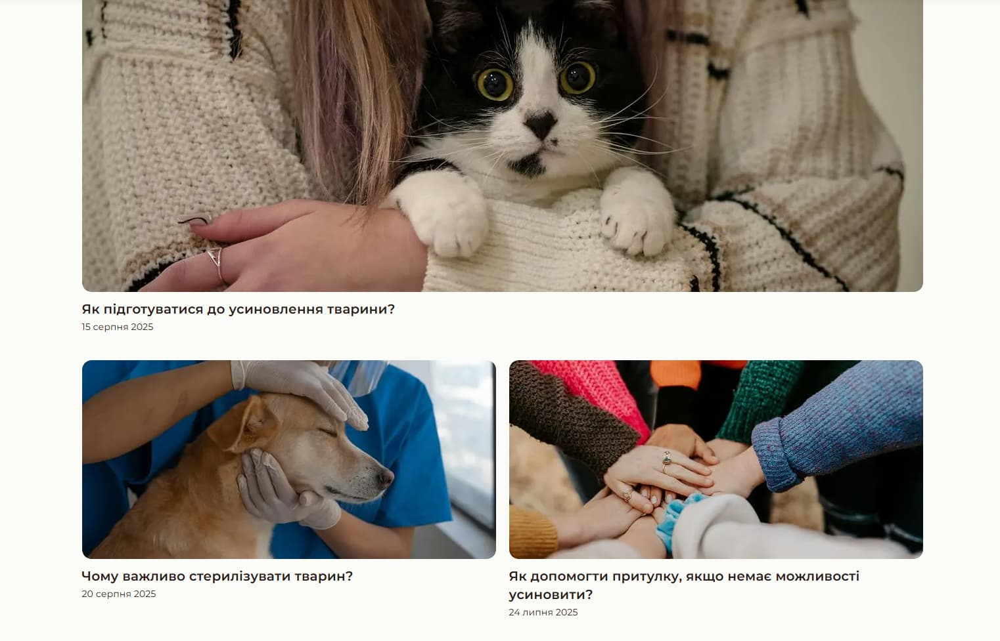  
_Список статей про догляд і всиновлення тварин_

### 💬 Сторінка «Відгуки» (Reviews)

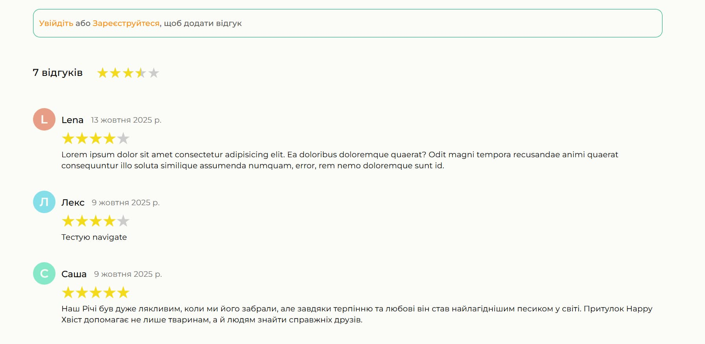  
_Список відгуків користувачів з можливістю додати або видалити власний_

### 🔐 Сторінка «Вхід» (Login)

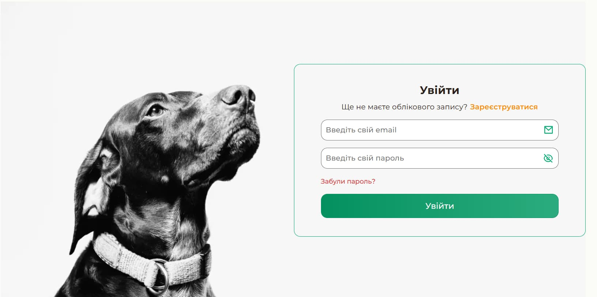  
_Форма авторизації користувача з валідацією_

### 📝 Сторінка «Реєстрація» (Register)

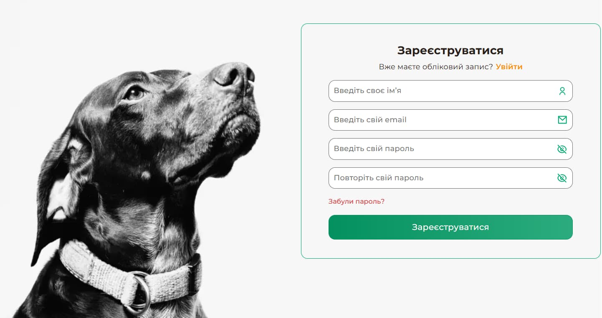  
_Форма створення нового акаунта з перевіркою введених даних_

---

## 🧩 Структура проєкту

```
happy-tail/
├── src/
│ ├── components/
│ ├── pages/
│ ├── redux/
│ ├── assets/
│ ├── utils/
│ └── main.jsx
├── public/
├── package.json
└── vite.config.js
```

---

## 🧠 Подальші плани

- 🐾 Додати адмін-панель для керування тваринами та відгуками
- 🌈 Додати анімації та інтерактивні ефекти
- 💾 Створити сторінку профілю користувача
- 📷 Можливість завантаження фото через форму

---

## 🧑‍💻 Автор

**Влад Ковальов**  
📎 [GitHub профіль](https://github.com/Vlad-Kovalov9)

🎨 **UI/UX дизайн:** створений спеціально для цього проєкту

---

## 🪪 Ліцензія

Цей проєкт є open source і доступний за [MIT License](LICENSE).
